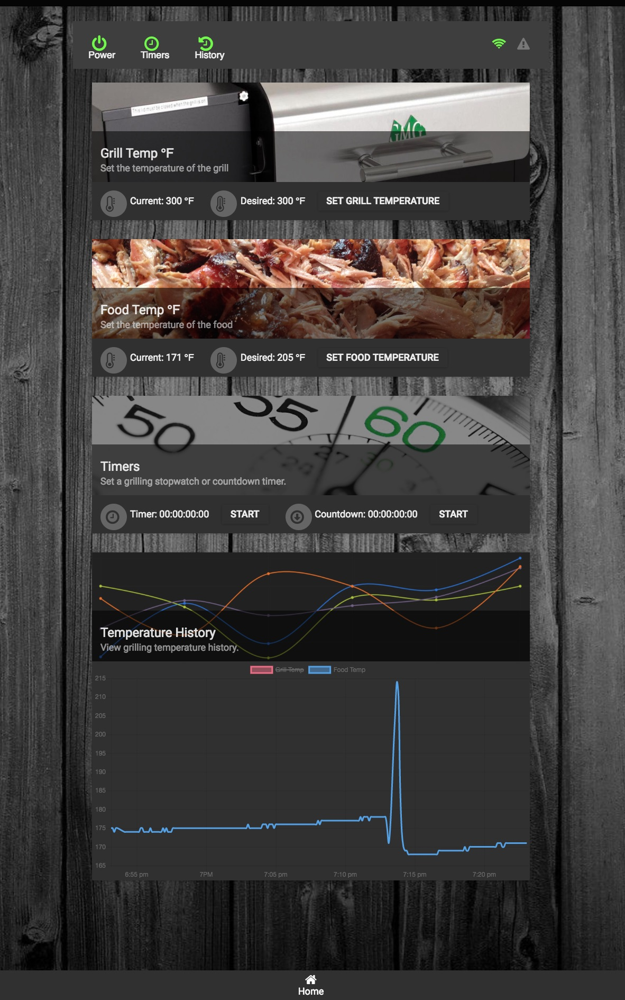

# Green Mountain Grills App

### This project is a silly alternative to the Green Mountain Grills mobile app.

## Why?
Well, I like to Grill, and I often utilize the grill overnight when cooking large portions. Unfortunately the GMG mobile app is not a dependable source for alerting me when critical grill events occur (like, the grill is out of fuel/pellets).

## Features
1. Slack Alerts
1. Configurable browser alerts sounds
1. Auto connect/reconnect
1. REST API and JS Client for extensions
1. Timers
1. Grill controls (Power, food temp, grill temp)

## Configuration
There are number of way to configure the server. You can set env variables in Docker to override any config that is provided in "custom-environment-variables" file located in the config directory. Alternatively, just override the default values set in default.json. The only option that you need to configure is the Slack web hook URL (`GMG_ALERTS_SLACK_WEBHOOKURL`). If you want to set your own alert sounds, simply override the corresponding mp3 file in the `public/alerts` directory.

## Setup and Run with Docker (Server cannot auto discover the grill, so you must provide it via ENV)
1. Clone this repo
1. Install docker
1. `cd` into the `src` directory
1. `docker build -t gmg .`
1. `docker run -it -p 80:80 -e "GMG_GRILL_HOST=xx.xx.xx.xx" -e "GMG_ALERTS_SLACK_WEBHOOKURL=https://your_slack_webhook_address" <GMG_IMAGE_NAME>`
Note: You can omit the GMG_ALERTS_SLACK_WEBHOOKURL env variable if you are not using slack.

## Setup and Run without Docker (*nix/mac only - Server will auto discover the grill)
1. Clone this repo
1. Set your slack webhook URL (see above)
1. `cd` into the `src` directory
1. `./build.sh`
1. `cd gmg-server && npm run start:release`
1. Optionally start the emulator `dotnet bin/Debug/netcoreapp2.1/gmg-emulator.dll`

## Development and Debugging Setup
1. Ensure you have node v8+, npm, and dotnet core 2.1+ SDK installed
1. Clone this repo
1. Server: Start node and attach to `src/gmg-server/bin/www` with IDE of choice (VSCode, Atom, WebStorm, etc.)
    1. If using VSCode, open workspace `gmg.code-workspace`
    2. Open Debug tab and click **Start Debugging** `Debug (gmg-server)`
1. UI: `(cd src/gmg-app && npm run start)` to start the development web server and webpack watch
1. Emulator: Open solution `src/gmg-emulator/gmg-emulator.sln` with IDE of choice (Rider, VSCode, Visual Studio, etc.)
    1. If using VSCode, open workspace `gmg.code-workspace`
    2. Open Debug tab and click **Start Debugging**  `Debug (gmg-emulator)`

## Setup and Run on a Raspberry PI with Ubuntu-mate
### [Install ubuntu-mate on RPi](https://ubuntu-mate.org/raspberry-pi/)
### Update all apt sources:

```
sudo apt-get update
```

### Install nodejs and npm
```
wget https://nodejs.org/dist/v8.9.0/node-v8.9.0-linux-armv6l.tar.gz
tar -xzf node-v8.9.0-linux-armv6l.tar.gz
cd node-v8.9.0-linux-armv6l/
sudo cp -R * /usr/local/
```

### Ensure nodejs and npm are installed:
```
node -v
npm -v
```

### Update npm:
```
sudo npm i -g npm@latest
```

### Pull the Green Mountain Grill App and install:

```
git clone https://github.com/Aenima4six2/gmg.git
cd /gmg/src
sudo ./build.sh
```

## Start the service:
```
cd gmg-server && sudo npm run start:release
```


## Preview

