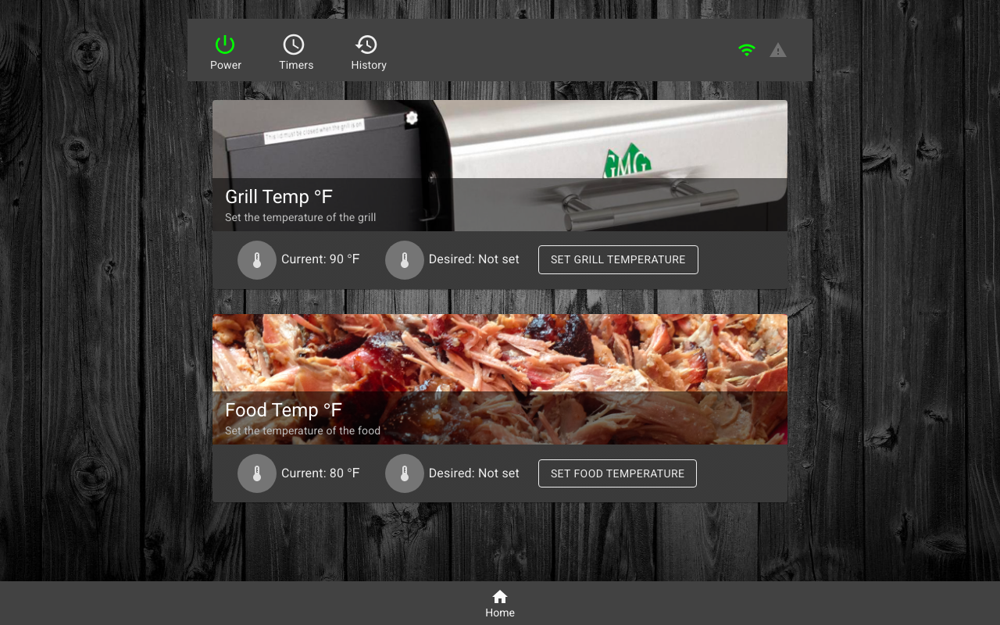

# Green Mountain Grills App

A web-based dashboard for monitoring and controlling Green Mountain Grills. Provides reliable alerting for critical grill events like low pellets or target temperatures being reached.

## Features
- Slack and webhook alerts for grill events
- Configurable browser alert sounds
- Auto connect/reconnect to grill
- Real-time temperature history chart
- Grill controls (power, food temp, grill temp)
- Timers (stopwatch and countdown)
- REST API and JS client for extensions

## Preview


## Running with Docker

Server cannot auto-discover the grill in Docker, so you must provide its IP:

```sh
cd src
docker build -t gmg .
docker run -it -p 80:80 -e "GMG_GRILL_HOST=xx.xx.xx.xx" gmg
```

You can omit `GMG_ALERTS_SLACK_WEBHOOKURL` if you're not using Slack.

## Testing with Docker Compose

Docker Compose runs the app alongside the grill emulator for local testing:

```sh
docker compose up --build
```

The app will be available at `http://localhost:3000`.

## Configuration

The server is configured via environment variables or config files in `src/gmg-server/config/`.

| Variable | Description | Default |
|----------|-------------|---------|
| `GMG_GRILL_HOST` | IP address of the grill | `255.255.255.255` (broadcast/auto-discover) |
| `GMG_GRILL_PORT` | Grill UDP port | `8080` |
| `GMG_STATUS_POLLING_INTERVAL` | Status poll interval (ms) | `5000` |
| `GMG_ALERTS_SLACK_WEBHOOKURL` | Slack webhook URL for alerts | none |

See `.env.example` for a template. To customize alert sounds, replace the mp3 files in `src/gmg-server/public/alerts/`.

## Development Setup

**Prerequisites:** Node 22+, .NET 9+ SDK (for the emulator)

1. Clone the repo
2. Start the emulator: `cd src/gmg-emulator && dotnet run`
3. Start the server: `cd src/gmg-server && npm install && npm run start:dev`
4. Start the UI: `cd src/gmg-app && npm install && npm run dev`

The dev server (Vite) runs on `http://localhost:5173` and proxies API requests to the server on port 3001.

VSCode users can open `gmg.code-workspace` and use the pre-configured debug launch configs.

## Makefile

A `Makefile` is included for common tasks. Run `make help` to see all targets:

```sh
make test          # start app + emulator via Docker Compose
make test-down     # stop testing environment
make test-logs     # tail Docker Compose logs
make test-rebuild  # rebuild and restart testing environment
make image         # build Docker image
make image-nc      # build with no cache
make install       # install all npm dependencies
make build         # build UI and publish to server
make dev           # start dev servers (server + Vite)
make clean         # remove node_modules and build artifacts
```

## Tech Stack
- **Frontend:** React 18, MUI 6, Vite, Chart.js 3, Socket.IO
- **Backend:** Express, Socket.IO, SQLite
- **Emulator:** .NET 9 (C#)
